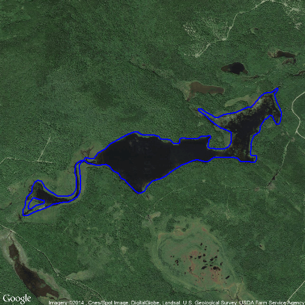

Compare lake areas and WBIDs for HUC01 and HUC02 lakes based on NHDplus Versions 1 and 2
========================================================
#Introduction:
We have two representations of the lakes of HUC regions 01 and 02


**Setup**
*  Install packages: rgdal, rgeos, sp, maptools, RgoogleMaps, ggplot2, ggmap
*  Load the NHD HUC01 & 02 lakes (MRB1) based on NHDplus Version 1. 
*  Reproject to Albers
*  Associate lake holes with correct polygon
*  Save as SpatialPolygonsDataFrame "V1"

Here are the first few lines of the V1 attribute data: 

```
##   OBJECTID WB_ID AlbersAreaM Centroid_Long Centroid_Lat ShorelineAlbersM
## 1        1   487       42396        -68.38        46.19            896.8
## 2        2   489       26178        -68.39        46.19            735.7
## 3        3   491     1480297        -68.38        46.18           7741.6
## 4        4   493       67348        -68.11        46.19           1056.2
## 5        5   495       68737        -68.42        46.18           1671.7
## 6        6   499       27255        -68.36        46.18            700.0
##   Shape_Length Shape_Area AlbersX AlbersY HUC_Region
## 1     0.009059  4.941e-06 2106441 1279649          1
## 2     0.008068  3.051e-06 2105817 1279255          1
## 3     0.084338  1.725e-04 2106786 1278696          1
## 4     0.011058  7.848e-06 2126595 1285107          1
## 5     0.019320  8.010e-06 2104045 1278093          1
## 6     0.008649  3.176e-06 2108146 1278936          1
```

**Note:**  for V1 the only important attribute (for now) is the WB_ID.  This is the unique id for the lake

*  Load the NHD HUC01 lakes based on NHDplus Version 2.
*  Load the NHD HUC02 lakes based on NHDplus Version 2.
*  Combine HUC01 and HUC02
*  Associate lake holes with correct polygon
*  Save as SpatialPolygonsDataFrame "V2"

Here are the first few lines of the V2 attribute data: 

```
##             COMID
## 10101972 10101972
## 10101978 10101978
## 10101982 10101982
## 10101984 10101984
## 10101986 10101986
## 10101990 10101990
```

**Note:**  for V2 the only attribute is the COMID.  This is the unique id for the lake and should match V1$WB_ID


**Compare V1 and V2**

WBID is the unique ID for the Waterbody.  This was derived from the NHDplus COMID.  The lakes files use different naming conventions in V1 the WBID is V1$WB_ID.  For V2 it is V2$COMID.  Both files are in the Albers projection.

Comparison Steps:
<br>
* calculate lake areas for V1 and V2
* merge the WBIDs and Areas for V1 and V2
* lakes with whose WBID and Area match are considered to be the same lake.  
* A dataframe (WBID_V1V2) is created with the matching that maps the WBIDs for V1 to those in V2.
* The "over" function from the "sp" package used to spatially join the lakes in V1 that are not matched in V2 (and vice versa).
* This provides a list of potential V1/V2 WBID matches
* area is merged to this list and lakes whose areas and locations match are considered to be the same lake with different WBIDs.  These WBIDs are added to WBID_V1V2
* This leaves a data.frame (chkV1V2) with information on lakes that need to be checked graphically.
* The list includes:
  1. Lakes in one Version that do not overlay lakes in the other version.  These could be lakes that were undetected in one version or were determined not to be lakes.
  2. Lakes whose positions overlap but the areas don't match.  In most cases one version of NHDplus divided the lakes differently than the other version (i.e. V1 shows 1 lake while V2 shows 2 lakes)
*The lakes listed in chkV1V2 were used to create the SpatialPolygonsDataFrame "chkLakes".  This was reprojected to WGS84 to match googlemaps


<br> 
**These are the lakes that need to be verified:**

```
##     WBID_V1   WBID_V2 nV1 nV2 flagWBID   areaV1   areaV2 perDif flagArea
## 1   1720193   1720187   2   1        1  1409433  1243674   0.12        1
## 2   1720193   1720193   2   1        1  1409433   165757   0.88        1
## 3  11686920   4724203   3   1        1 75539790    16735   1.00        1
## 4  11686920   4726045   3   1        1 75539790 46468664   0.38        1
## 5   9312497   5842312   2   1        1  3939308  3015457   0.23        1
## 6  22222791   7688829   2   1        1  2367407  2305872   0.03        1
## 7  22223101   7689297   3   1        1    49256     8773   0.82        1
## 8   8390908   8390908   1   1        0   338542   112019   0.67        1
## 9   9326606   9326590   2   1        1  4655489  1151119   0.75        1
## 10  9326606   9326606   2   1        1  4655489  3504371   0.25        1
## 11 22223101   9344247   3   1        1    49256    14948   0.70        1
## 12  9479066   9443357   2   1        1    90662    82919   0.09        1
## 13  9479066   9479066   2   1        1    90662     7742   0.91        1
## 14  9512548   9512546   2   1        1  9198135  9072954   0.01        1
## 15  9512548   9512548   2   1        1  9198135   125180   0.99        1
## 16       NA  15516920  NA   1        2       NA    14580     NA        0
## 17       NA  15516922  NA   1        2       NA    14710     NA        0
## 18 22222791  22222791   2   1        1  2367407  2305872   0.03        1
## 19       NA  60444415  NA   1        2       NA    58649     NA        0
## 20  7717850 120052268   1   2        1  3821949 10364202   1.71        1
## 21  7717818 120052268   1   2        1  6542258 10364202   0.58        1
## 22 11686920 120053255   3   1        1 75539790 29054387   0.62        1
## 23  9312497 120053397   2   1        1  3939308   898004   0.77        1
## 24  8086079 120053438   1   2        1    21356    34158   0.60        1
## 25 22746261 120053438   1   2        1    12801    34158   1.67        1
## 26  6732123 166174267   1   1        0   169247 15832932  92.55        1
## 27 22223101 166174657   3   1        1    49256    25534   0.48        1
## 28  6094729 166174730   1   1        0    11963  5123479 427.28        1
## 29       NA 166421080  NA   1        2       NA 97407208     NA        0
## 30  6710763 931050002   1   1        0     9314   375329  39.30        1
## 31  6760548 931070002   1   1        0    24786 15283308 615.61        1
## 32 22287665        NA   1  NA        2    67309       NA     NA        0
## 33 10312598        NA   1  NA        2  4707417       NA     NA        0
## 34  4782861        NA   1  NA        2 15023566       NA     NA        0
## 35 22287527        NA   1  NA        2   717449       NA     NA        0
##    flag
## 1     1
## 2     1
## 3     1
## 4     1
## 5     1
## 6     1
## 7     1
## 8     1
## 9     1
## 10    1
## 11    1
## 12    1
## 13    1
## 14    1
## 15    1
## 16    1
## 17    1
## 18    1
## 19    1
## 20    1
## 21    1
## 22    1
## 23    1
## 24    1
## 25    1
## 26    1
## 27    1
## 28    1
## 29    1
## 30    1
## 31    1
## 32    1
## 33    1
## 34    1
## 35    1
```

************
**Data Definitions chkV1V2**: 
chkV1V2 is a data.frame with 35 obs. and 10 variables

**Field**  | **Definition**
------------- | ------------- 
WBID_V1 | Waterbody ID for NHDplus V1 lakes; same as V1$WB_ID
WBID_V2 | Waterbody ID for NHDplus V2 lakes; same as V1$COMID
nV1** | number of times WBID_V1 appears in the list; multiple occurrences need to be checked 
nV2** | number of times WBID_V2 appears in the list; multiple occurrences need to be checked 
flagWBID  | 0 = no flag; 1 = multiple occurence of V1 or V2 WBID in list; 2 = lakes exists in one version but not the other
areaV1 | (m2) area of the V1 lake
areaV2 | (m2) area of the V2 lake

************
**The following objects were saved in './data/CompV1V2.rda': 

**data.frame**  | **Description**
------------- | ------------- 
V1 | SpatialPolygonsDataFrame for the NHDplus Version 1 lakes in HUCs 01 and 02 (Albers Projection)
V2 | SpatialPolygonsDataFrame for the NHDplus Version 2  lakes in HUCs 01 and 02 (Albers Projection)
WBID_V1V2 | data.frame with a list of WBID matches for NHDplus Version 1 & 2 lakes in HUCs 01 & 02 
chkV1V2 | NHDplus Version 1 & 2 lakes in HUCs 01 & 02 that need further verification
chkLakes | SpatialPolygonsDataFrame for the V1 and V2 lakes in chkV1V2 (WGS84 Projection)


************
<br> 
**Visually check the flagged lakes:**
<br>
* Look at chkV1V2 and select the row numbers that appear to correspond to the same lake


```
## Map from URL : http://maps.googleapis.com/maps/api/staticmap?center=45.418623,-69.298091&zoom=14&size=%20640x640&scale=%202&maptype=satellite&sensor=false
## Google Maps API Terms of Service : http://developers.google.com/maps/terms
## Regions defined for each Polygons
```

   


