Create a table to join the Waterbody IDs (WBID) for lakes in MRB1 (HUC01 and HUC02) from NHDplus Version 1 and 2
========================================================
<!---
use these command instead of the knit icon if you want the data and work loaded into the R workspace
  library(knitr)
  knit('./tables/joinMRB1_V1V2.rmd')
-->
Introduction:
-------------------------
* We have two versions of the lakes of MRB1 (Major River Basin 1: HUC regions 01 and 02) from NHDplus.  
* Need to compare the two version to see if the WB_IDs (unique identifiers), lake locations, and areas match.  
* The output is a table (joinMRB1_V1B2) that crosswalks the WB_IDs from one version to the other.
* This document shows the details of the data comparisons and the creation of the join table.

************
The following code will open the formatted text version of the Rmarkdown file in a browser:
************
    browseURL('https://github.com/willbmisled/LakesDB/blob/master/tables/joinMRB1_V1V2.md')
************
The data can be loaded into R with the following code:
************
  #Get the Data
    load(url('https://raw.github.com/willbmisled/LakesDB/master/tables/joinMRB1_V1V2.rda')

Data Definitions 
-------------------------
joinMRB1_V1V2 is a data frame with 28136 obs. and 4 variables

**joinMRB1_V1V2 Data Definitions:**

**Field**  | **Definition**
------------- | ------------- 
**WBID_V1** | Waterbody ID for NHDplus V1 lakes; same as V1$WB_ID
**WBID_V2** | Waterbody ID for NHDplus V2 lakes; same as V1$COMID
**flag**  | Indicates that the there may be differences in how V1 and V2 represent the lake (see below)
**comment** | additional information on the lake or the flag

**joinMRB1_V1V2 flag Definitions:**

**Flag**  | **Definition**
------------- | ------------- 
flag==0 | Lakes Colocated with equal areas; Note: WBIDs may be the same or different in V1 and V2
flag==1 | Single Lake in V1 split into two or more lakes in V2
flag==2 | Multiple Lakes in V1 represented as a single lake in V2
flag==3 | Lakes collocated but areas unequal
flag==4 | In V1 but not V2
flag==5 | In V2 but not V1
flag==6 | V2 Duplicate lake; V2_166421080=V2_19333669=V1_19333669


Data
-------------------------
*  Load the NHD HUC01 & 02 lakes (MRB1) based on NHDplus Version 1. 
*  Reproject to Albers
*  Associate lake holes with correct polygon
*  Save as SpatialPolygonsDataFrame "V1"

Here are the first few lines of the V1 attribute data: 

```
##   OBJECTID WB_ID AlbersAreaM Centroid_Long Centroid_Lat ShorelineAlbersM
## 1        1   487       42396        -68.38        46.19            896.8
## 2        2   489       26178        -68.39        46.19            735.7
## 3        3   491     1480297        -68.38        46.18           7741.6
## 4        4   493       67348        -68.11        46.19           1056.2
## 5        5   495       68737        -68.42        46.18           1671.7
## 6        6   499       27255        -68.36        46.18            700.0
##   Shape_Length  Shape_Area AlbersX AlbersY HUC_Region
## 1     0.009059 0.000004941 2106441 1279649          1
## 2     0.008068 0.000003051 2105817 1279255          1
## 3     0.084338 0.000172488 2106786 1278696          1
## 4     0.011058 0.000007848 2126595 1285107          1
## 5     0.019320 0.000008010 2104045 1278093          1
## 6     0.008649 0.000003176 2108146 1278936          1
```

**Note:**  for V1 the only important attribute (for now) is the WB_ID.  This is the unique id for the lake

*  Load the NHD HUC01 lakes based on NHDplus Version 2.
*  Load the NHD HUC02 lakes based on NHDplus Version 2.
*  Combine HUC01 and HUC02
*  Associate lake holes with correct polygon
*  Save as SpatialPolygonsDataFrame "V2"

Here are the first few lines of the V2 attribute data: 

```
##             COMID
## 10101972 10101972
## 10101978 10101978
## 10101982 10101982
## 10101984 10101984
## 10101986 10101986
## 10101990 10101990
```

**Note:**  for V2 the only attribute is the COMID.  This is the unique id for the lake and should match V1$WB_ID


Compare V1 and V2
-------------------------

WBID is the unique ID for the Waterbody.  This was derived from the NHDplus COMID.  The lakes files use different naming conventions in V1 the WBID is V1$WB_ID.  For V2 it is V2$COMID.  Both files are in the Albers projection.

Comparison Steps:
<br>
* calculate lake areas for V1 and V2
* merge the WBIDs and Areas for V1 and V2
* lakes with whose WBID and Area match are considered to be the same lake.  
* A dataframe (joinMRB1_V1V2) is created with the matching that maps the WBIDs for V1 to those in V2.
* The "over" function from the "sp" package used to spatially join the lakes in V1 that are not matched in V2 (and vice versa).
* This provides a list of potential V1/V2 WBID matches
* area is merged to this list and lakes whose areas and locations match are considered to be the same lake with different WBIDs.  These WBIDs are added to joinMRB1_V1V2
* This leaves a data.frame (chkV1V2) with information on lakes that need to be checked graphically.
* The list includes:
  1. Lakes in one Version that do not overlay lakes in the other version.  These could be lakes that were undetected in one version or were determined not to be lakes.
  2. Lakes whose positions overlap but the areas don't match.  In most cases one version of NHDplus divided the lakes differently than the other version (i.e. V1 shows 1 lake while V2 shows 2 lakes)
*The lakes listed in chkV1V2 were used to create the SpatialPolygonsDataFrame "chkLakes".  This was reprojected to WGS84 to match googlemaps


<br> 
**These are the lakes that need to be verified:**

```
##     WBID_V1   WBID_V2 nV1 nV2 flagWBID   areaV1   areaV2 perDif flagArea
## 1   1720193   1720187   2   1        1  1409433  1243674   0.12        1
## 2   1720193   1720193   2   1        1  1409433   165757   0.88        1
## 3   9312497   5842312   2   1        1  3939308  3015457   0.23        1
## 4   9312497 120053397   2   1        1  3939308   898004   0.77        1
## 5   9326606   9326590   2   1        1  4655489  1151119   0.75        1
## 6   9326606   9326606   2   1        1  4655489  3504371   0.25        1
## 7   9479066   9443357   2   1        1    90662    82919   0.09        1
## 8   9479066   9479066   2   1        1    90662     7742   0.91        1
## 9   9512548   9512546   2   1        1  9198135  9072954   0.01        1
## 10  9512548   9512548   2   1        1  9198135   125180   0.99        1
## 11 11686920   4724203   3   1        1 75539790    16735   1.00        1
## 12 11686920   4726045   3   1        1 75539790 46468664   0.38        1
## 13 11686920 120053255   3   1        1 75539790 29054387   0.62        1
## 14 22222791   7688829   2   1        1  2367407  2305872   0.03        1
## 15 22222791  22222791   2   1        1  2367407  2305872   0.03        1
## 16 22223101   7689297   3   1        1    49256     8773   0.82        1
## 17 22223101   9344247   3   1        1    49256    14948   0.70        1
## 18 22223101 166174657   3   1        1    49256    25534   0.48        1
## 19  7717818 120052268   1   2        1  6542258 10364202   0.58        1
## 20  7717850 120052268   1   2        1  3821949 10364202   1.71        1
## 21  8086079 120053438   1   2        1    21356    34158   0.60        1
## 22 22746261 120053438   1   2        1    12801    34158   1.67        1
## 23  6094729 166174730   1   1        0    11963  5123479 427.28        1
## 24  6710763 931050002   1   1        0     9314   375329  39.30        1
## 25  6732123 166174267   1   1        0   169247 15832932  92.55        1
## 26  6760548 931070002   1   1        0    24786 15283308 615.61        1
## 27  8390908   8390908   1   1        0   338542   112019   0.67        1
## 28       NA  15516920  NA   1        2       NA    14580     NA        2
## 29       NA  15516922  NA   1        2       NA    14710     NA        2
## 30       NA  60444415  NA   1        2       NA    58649     NA        2
## 31       NA 166421080  NA   1        2       NA 97407208     NA        2
## 32  4782861        NA   1  NA        2 15023566       NA     NA        2
## 33 10312598        NA   1  NA        2  4707417       NA     NA        2
## 34 22287527        NA   1  NA        2   717449       NA     NA        2
## 35 22287665        NA   1  NA        2    67309       NA     NA        2
```


<br> 
Visually check the flagged lakes with colocated matches:
-------------------------
* ChkV1V2 sorted by WBID_V1 and WBID_V2
* From the list choose the row numbers of lakes that appear as a single lake in one version and multiple lakes in another and plot them.
* lakes plotted first by version then as an overlay on a google map.
* Visually check the plots and decide how to resolve the differences
* Update joinMRB1_V1V2

* For **chkV1V2[c(1, 2),]** 
  * WBID_v1=c(1720193)
  * WBID_v2=c(1720187, 1720193)  
* Plotting the lakes (see below) indicates they are contiguous and could be joined or separate.
* Add WBIDs to joinMRB1_V1V2 with flag=1 indicating a single lake in V1 maps to multiple lake in V2


```
## Map from URL : http://maps.googleapis.com/maps/api/staticmap?center=45.418623,-69.298091&zoom=14&size=%20640x640&scale=%202&maptype=satellite&sensor=false
## Google Maps API Terms of Service : http://developers.google.com/maps/terms
## Regions defined for each Polygons
```

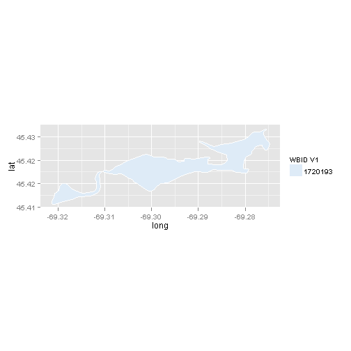 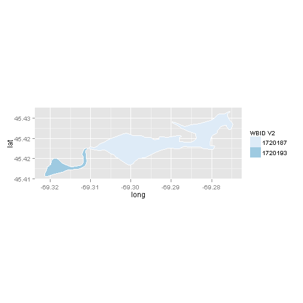 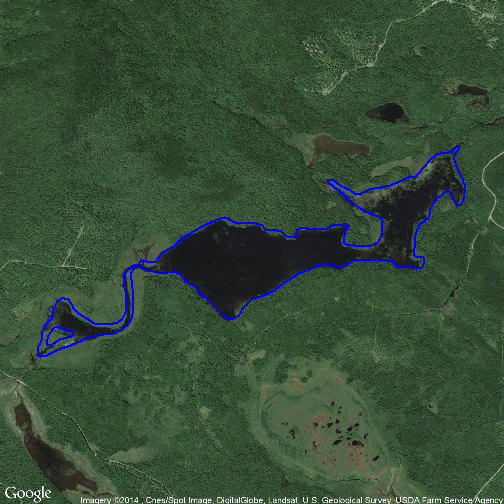 


* For **chkV1V2[c(3, 4),]** 
  * WBID_v1=c(9312497)
  * WBID_v2=c(5842312, 120053397)
* Plotting the lakes (see below) indicates they are contiguous and could be joined or separate.
* Add WBIDs to joinMRB1_V1V2 with flag=1 indicating a single lake in V1 maps to multiple lake in V2


```
## Map from URL : http://maps.googleapis.com/maps/api/staticmap?center=43.522295,-70.862386&zoom=13&size=%20640x640&scale=%202&maptype=satellite&sensor=false
## Google Maps API Terms of Service : http://developers.google.com/maps/terms
## Regions defined for each Polygons
```

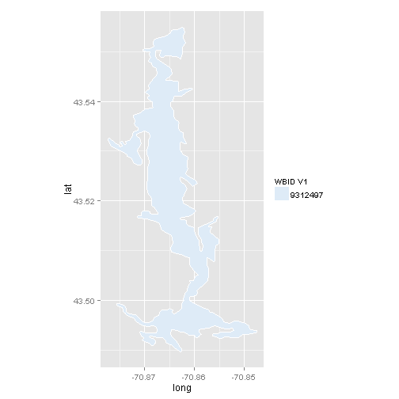 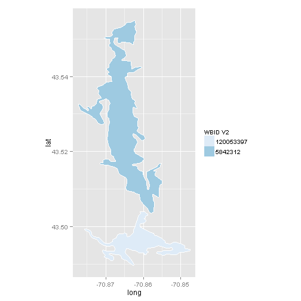 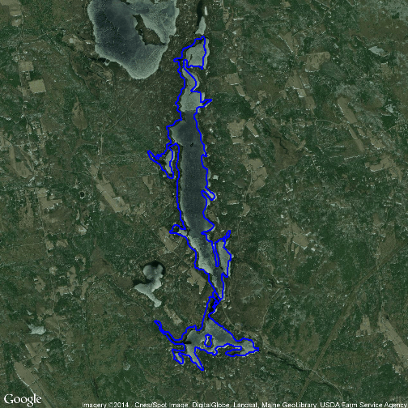 

* For **chkV1V2[c(5, 6),]** 
  * WBID_v1=c(9326606)
  * WBID_v2=c(9326590, 9326606)
* Plotting the lakes (see below) indicates they are contiguous and could be joined or separate.
* Add WBIDs to joinMRB1_V1V2 with flag=1 indicating a single lake in V1 maps to multiple lake in V2


```
## Map from URL : http://maps.googleapis.com/maps/api/staticmap?center=43.627879,-72.151526&zoom=13&size=%20640x640&scale=%202&maptype=satellite&sensor=false
## Google Maps API Terms of Service : http://developers.google.com/maps/terms
## Regions defined for each Polygons
```

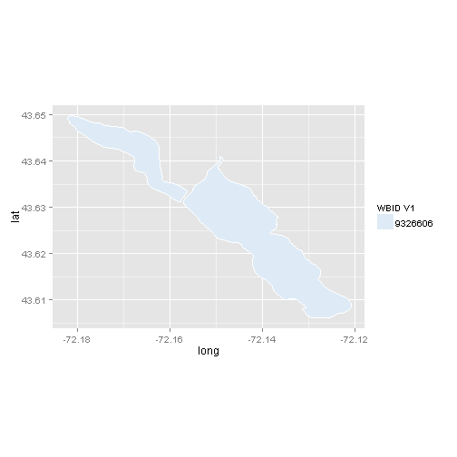 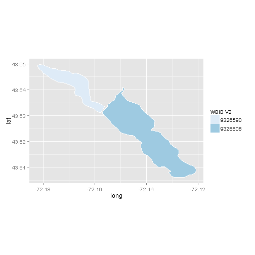 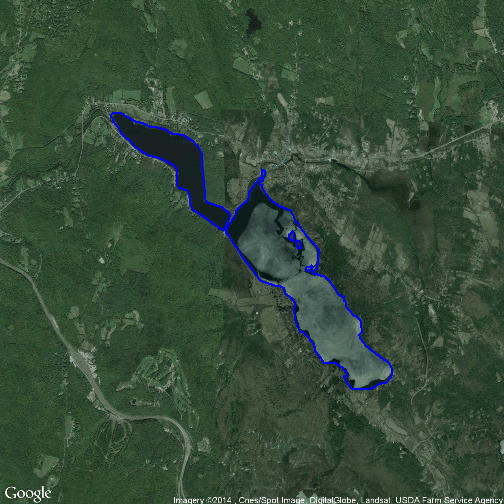 


* For **chkV1V2[c(7, 8),]** 
  * WBID_v1=c(9479066)
  * WBID_v2=c(9443357, 9479066)
* Plotting the lakes (see below) indicates they are contiguous and could be joined or separate.
* Add WBIDs to joinMRB1_V1V2 with flag=1 indicating a single lake in V1 maps to multiple lake in V2


```
## Map from URL : http://maps.googleapis.com/maps/api/staticmap?center=39.559788,-74.393368&zoom=16&size=%20640x640&scale=%202&maptype=satellite&sensor=false
## Google Maps API Terms of Service : http://developers.google.com/maps/terms
## Regions defined for each Polygons
```

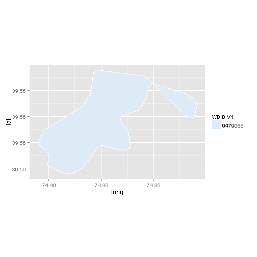 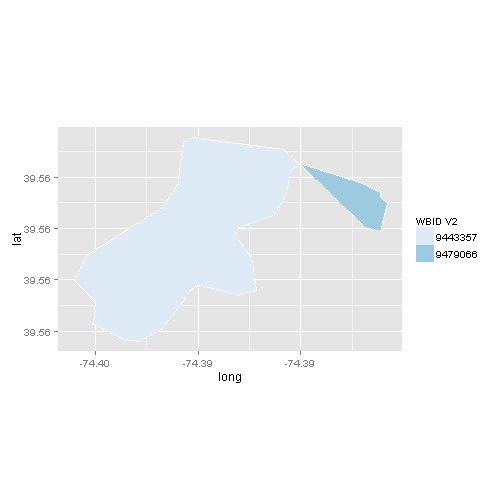 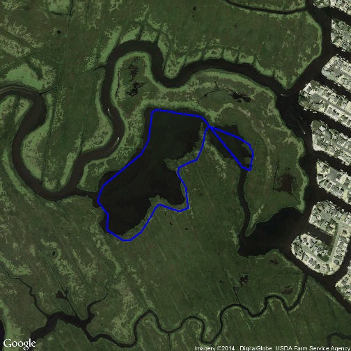 


* For **chkV1V2[c(9, 10),]** 
  * WBID_v1=c(9512548)
  * WBID_v2=c(9512546, 9512548)
* Plotting the lakes (see below) indicates they are contiguous and could be joined or separate.
* Add WBIDs to joinMRB1_V1V2 with flag=1 indicating a single lake in V1 maps to multiple lake in V2


```
## Map from URL : http://maps.googleapis.com/maps/api/staticmap?center=40.616363,-74.828838&zoom=13&size=%20640x640&scale=%202&maptype=satellite&sensor=false
## Google Maps API Terms of Service : http://developers.google.com/maps/terms
## Regions defined for each Polygons
```

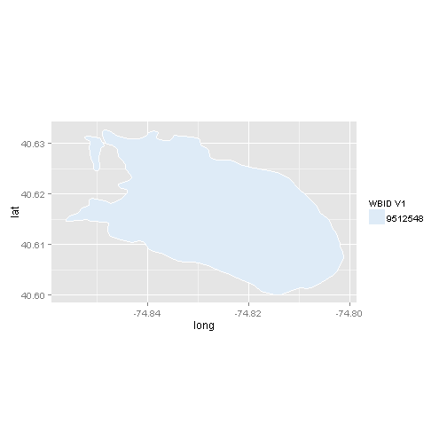 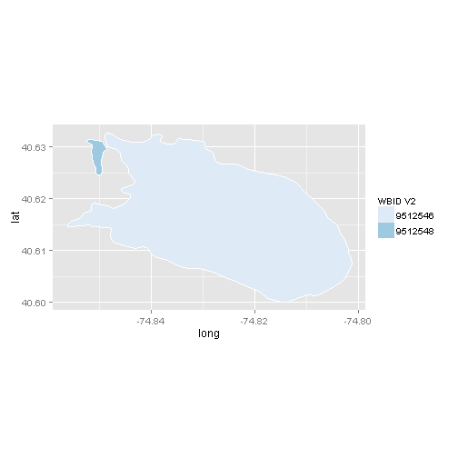 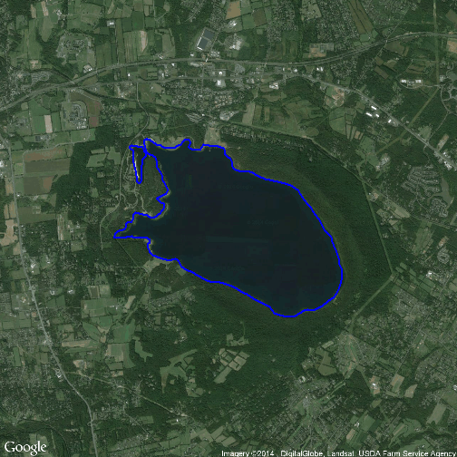 


* For **chkV1V2[c(11, 12, 13),]** 
  * WBID_v1=c(11686920)
  * WBID_v2=c(4724203, 4726045, 120053255)
* Plotting the lakes (see below) indicates they are contiguous and could be joined or separate.
* Add WBIDs to joinMRB1_V1V2 with flag=1 indicating a single lake in V1 maps to multiple lake in V2


```
## Map from URL : http://maps.googleapis.com/maps/api/staticmap?center=39.845476,-76.350141&zoom=10&size=%20640x640&scale=%202&maptype=satellite&sensor=false
## Google Maps API Terms of Service : http://developers.google.com/maps/terms
## Regions defined for each Polygons
```

   


* For **chkV1V2[c(14, 15),]** 
  * WBID_v1=c(22222791)
  * WBID_v2=c(7688829, 22222791)
* Plotting the lakes (see below) indicates they are contiguous and could be joined or separate.
* Add WBIDs to joinMRB1_V1V2 with flag=1 indicating a single lake in V1 maps to multiple lake in V2


```
## Map from URL : http://maps.googleapis.com/maps/api/staticmap?center=42.410645,-72.22527&zoom=14&size=%20640x640&scale=%202&maptype=satellite&sensor=false
## Google Maps API Terms of Service : http://developers.google.com/maps/terms
## Regions defined for each Polygons
```

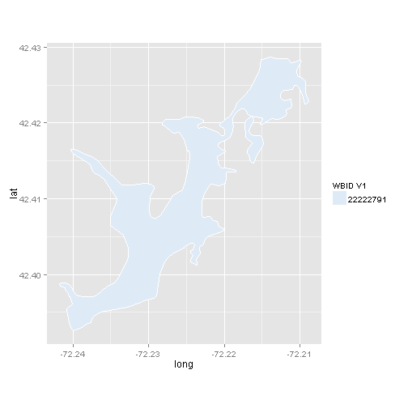 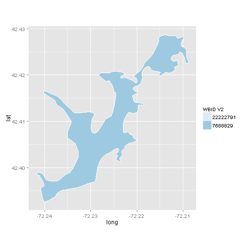 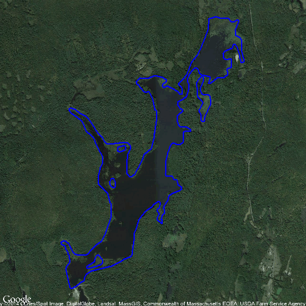 


* For **chkV1V2[c(16, 17, 18),]** 
  * WBID_v1=c(22223101)
  * WBID_v2=c(7689297, 9344247, 166174657)
* Plotting the lakes (see below) indicates they are contiguous and could be joined or separate.
* Add WBIDs to joinMRB1_V1V2 with flag=1 indicating a single lake in V1 maps to multiple lake in V2
                                     


```
## Map from URL : http://maps.googleapis.com/maps/api/staticmap?center=42.212832,-71.999227&zoom=16&size=%20640x640&scale=%202&maptype=satellite&sensor=false
## Google Maps API Terms of Service : http://developers.google.com/maps/terms
## Regions defined for each Polygons
```

   


* For **chkV1V2[c(19, 20),]** 
  * WBID_v1=c(7717818, 7717850)
  * WBID_v2=c(120052268)
* Plotting the lakes (see below) indicates they are contiguous and could be joined or separate.
* Add WBIDs to joinMRB1_V1V2 with flag=2 indicating multiple lakes in V1 map to a single lake in V2


```
## Map from URL : http://maps.googleapis.com/maps/api/staticmap?center=41.461673,-73.289158&zoom=11&size=%20640x640&scale=%202&maptype=satellite&sensor=false
## Google Maps API Terms of Service : http://developers.google.com/maps/terms
## Regions defined for each Polygons
```

   


* For **chkV1V2[c(21, 22),]** 
  * WBID_v1=c(8086079, 22746261)
  * WBID_v2=c(120053438)
* Plotting the lakes (see below) indicates they are contiguous and could be joined or separate.
* Add WBIDs to joinMRB1_V1V2 with flag=2 indicating multiple lakes in V1 map to a single lake in V2


```
## Map from URL : http://maps.googleapis.com/maps/api/staticmap?center=42.499641,-75.15594&zoom=17&size=%20640x640&scale=%202&maptype=satellite&sensor=false
## Google Maps API Terms of Service : http://developers.google.com/maps/terms
## Regions defined for each Polygons
```

   


* For **chkV1V2[c(23),]** 
  * WBID_v1=c(6094729)
  * WBID_v2=c(166174730)
* Plotting the lakes (see below) indicates that V1 and V2 have different views of this lake.
* From the googlemap image it looks like it isn't really a lake or a small one.
* The V2 lake (WBID==166174730) is much larger than the V1 lake (WBID=6094729)
* When plotted together it is clear that the V1 lake is a tiny spot on the south end of V2
* Add WBIDs to joinMRB1_V1V2 with flag=3 and the comment: Lakes collocated but areas unequal


```
## Map from URL : http://maps.googleapis.com/maps/api/staticmap?center=42.327423,-72.856455&zoom=12&size=%20640x640&scale=%202&maptype=satellite&sensor=false
## Google Maps API Terms of Service : http://developers.google.com/maps/terms
## Regions defined for each Polygons
```

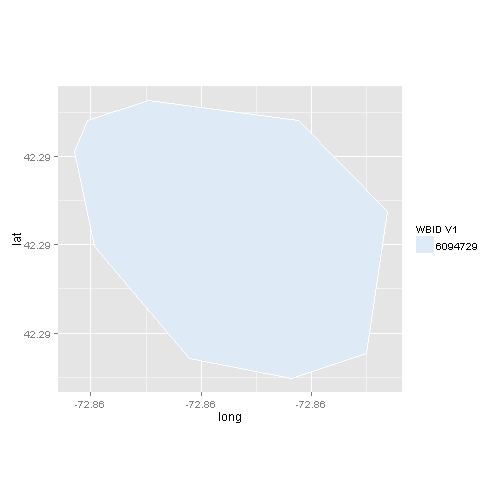 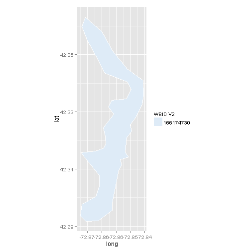 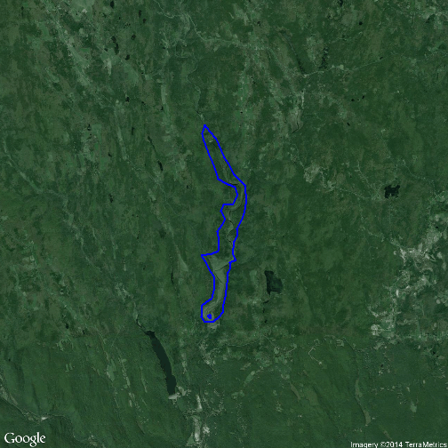 


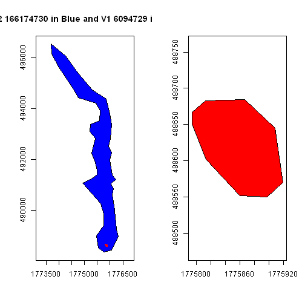 


* For **chkV1V2[c(24),]** 
  * WBID_v1=c(6710763)
  * WBID_v2=c(931050002)
* Plotting the lakes (see below) indicates that V1 and V2 have different views of this lake.
* From the googlemap image it looks like the V2 is a much better representation of the lake.
* The V2 lake (WBID==931050002) is much larger than the V1 lake (WBID=6710763)
* When plotted together it is clear that the V1 lake is a portion of V2
* Add WBIDs to joinMRB1_V1V2 with flag=3 and the comment: Lakes collocated but areas unequal


```
## Map from URL : http://maps.googleapis.com/maps/api/staticmap?center=44.254117,-69.531488&zoom=16&size=%20640x640&scale=%202&maptype=satellite&sensor=false
## Google Maps API Terms of Service : http://developers.google.com/maps/terms
## Regions defined for each Polygons
```

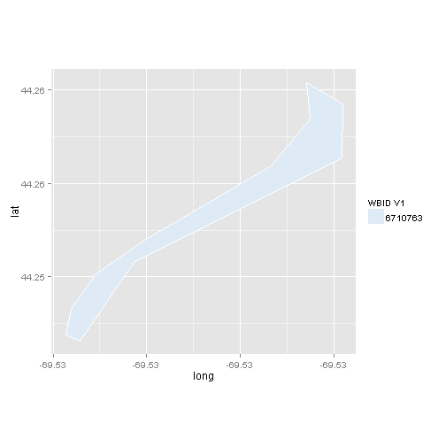 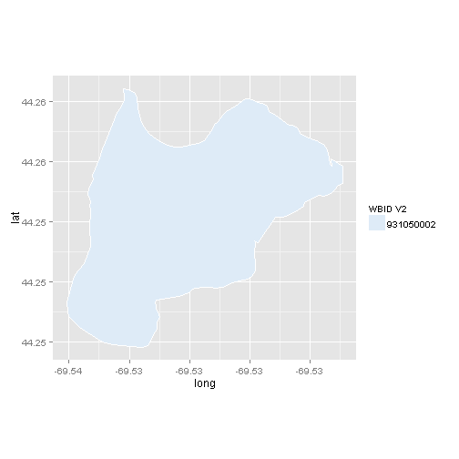 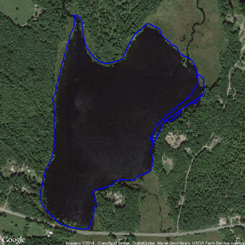 


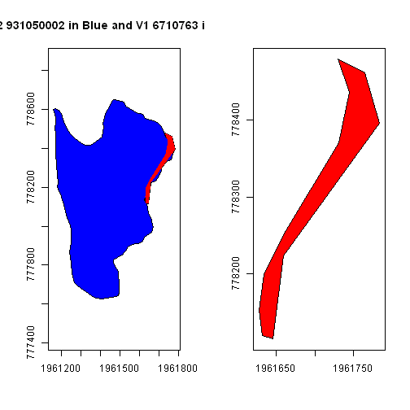 


* For **chkV1V2[c(25),]** 
  * WBID_v1=c(6732123)
  * WBID_v2=c(166174267)
* Plotting the lakes (see below) indicates that V1 and V2 have different views of this lake.
* From the googlemap image it looks like the V2 is a much better representation of the lake.
* The V2 lake (WBID==166174267) is much larger than the V1 lake (WBID=6732123)
* When plotted together it is clear that the V1 lake is a portion of V2
* Add WBIDs to joinMRB1_V1V2 with flag=3 and the comment: Lakes collocated but areas unequal


```
## Map from URL : http://maps.googleapis.com/maps/api/staticmap?center=43.517782,-71.689855&zoom=12&size=%20640x640&scale=%202&maptype=satellite&sensor=false
## Google Maps API Terms of Service : http://developers.google.com/maps/terms
## Regions defined for each Polygons
```

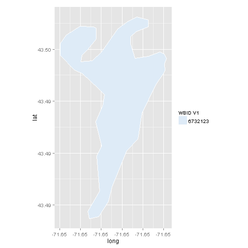 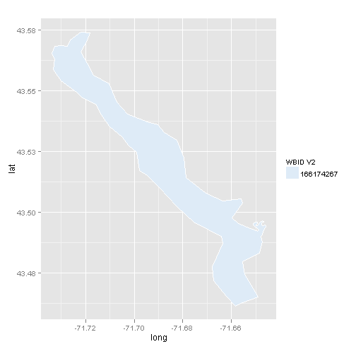 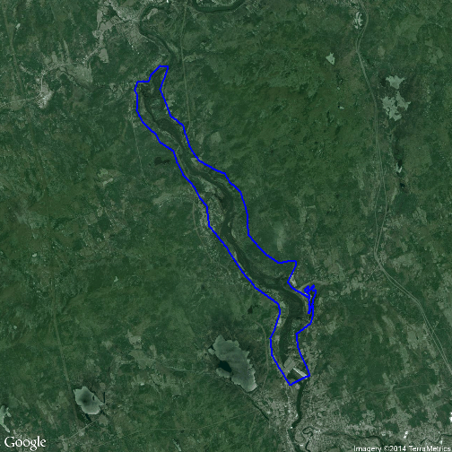 


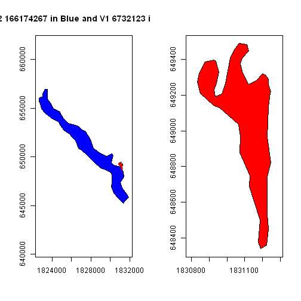 


* For **chkV1V2[c(26),]** 
  * WBID_v1=c(6760548)
  * WBID_v2=c(931070002)
* Plotting the lakes (see below) indicates that V1 and V2 have different views of this lake.
* From the googlemap image it looks like the V2 is a much better representation of the lake.
* The V2 lake (WBID==931070002) is much larger than the V1 lake (WBID=6760548)
* When plotted together it is clear that the V1 lake is a portion of V2
* Add WBIDs to joinMRB1_V1V2 with flag=3 and the comment: Lakes collocated but areas unequal


```
## Map from URL : http://maps.googleapis.com/maps/api/staticmap?center=43.35065,-71.757673&zoom=12&size=%20640x640&scale=%202&maptype=satellite&sensor=false
## Google Maps API Terms of Service : http://developers.google.com/maps/terms
## Regions defined for each Polygons
```

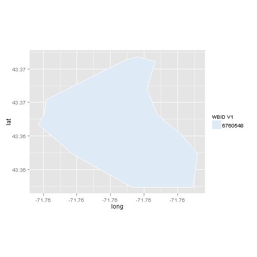 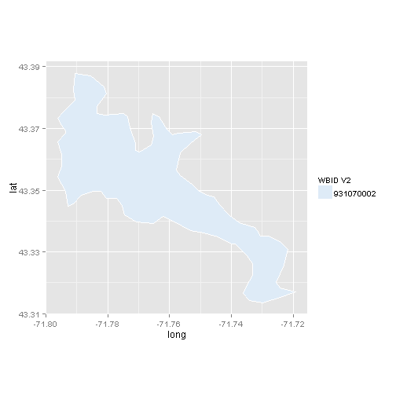 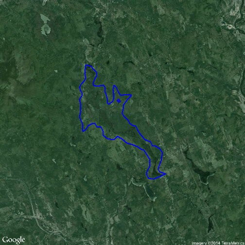 


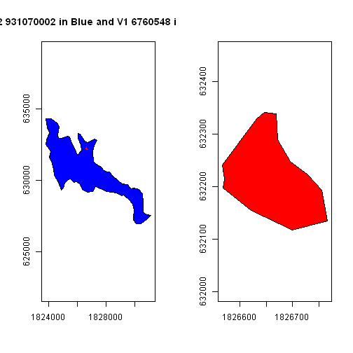 


* For **chkV1V2[c(27),]** 
  * WBID_v1=c(8390908)
  * WBID_v2=c(8390908)
* Plotting the lakes (see below) indicates that V1 and V2 have different views of this lake.
* From the googlemap image it looks like the V2 is a much better representation of the lake.
* The V2 lake (WBID==8390908) is much larger than the V1 lake (WBID=8390908)
* When plotted together it is clear that the V1 lake is a portion of V2
* Add WBIDs to joinMRB1_V1V2 with flag=3 and the comment: Lakes collocated but areas unequal


```
## Map from URL : http://maps.googleapis.com/maps/api/staticmap?center=38.558567,-75.557132&zoom=16&size=%20640x640&scale=%202&maptype=satellite&sensor=false
## Google Maps API Terms of Service : http://developers.google.com/maps/terms
## Regions defined for each Polygons
```

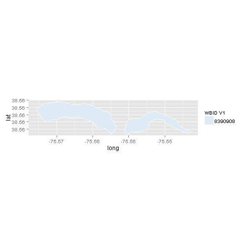 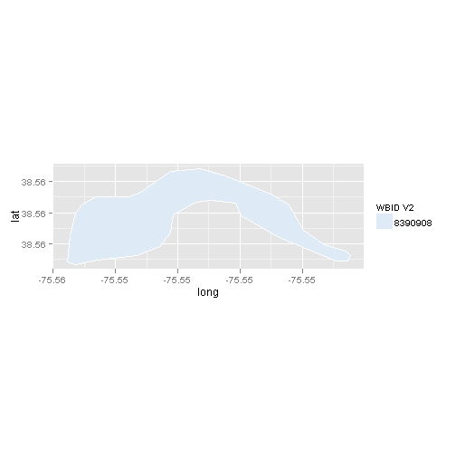 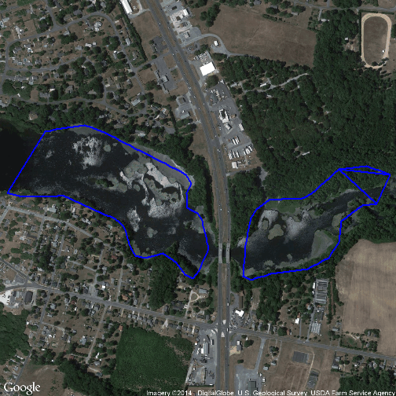 


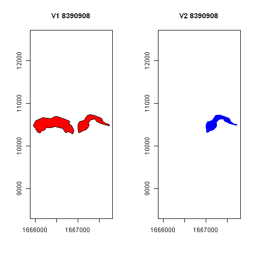 


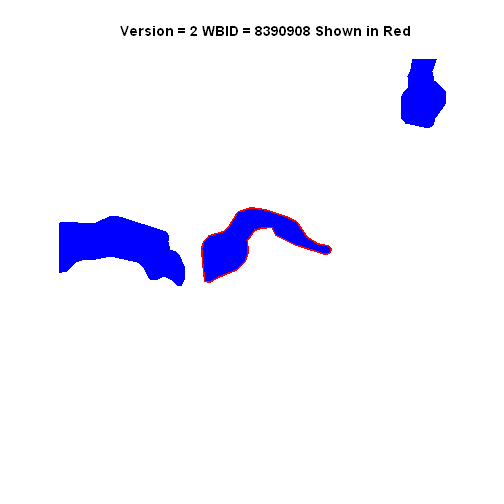 

<br> 
Visually check the lakes without matches in the other version
-------------------------

* Four lakes present in V1 not present in V2
* Four lakes present in V2 not present in V1


```
##     WBID_V1   WBID_V2 nV1 nV2 flagWBID   areaV1   areaV2 perDif flagArea
## 28       NA  15516920  NA   1        2       NA    14580     NA        2
## 29       NA  15516922  NA   1        2       NA    14710     NA        2
## 30       NA  60444415  NA   1        2       NA    58649     NA        2
## 31       NA 166421080  NA   1        2       NA 97407208     NA        2
## 32  4782861        NA   1  NA        2 15023566       NA     NA        2
## 33 10312598        NA   1  NA        2  4707417       NA     NA        2
## 34 22287527        NA   1  NA        2   717449       NA     NA        2
## 35 22287665        NA   1  NA        2    67309       NA     NA        2
##    flag
## 28    1
## 29    1
## 30    1
## 31    1
## 32    1
## 33    1
## 34    1
## 35    1
```

* Plot lake of interest
* Adjust xlim and ylim to an area around the lake
* Plot lakes for the other Version that are in the same vicinity
* Plot lake on google map to see what it looks like
* View plots and resolve the differences.
* Update joinMRB1_V1V2

The missing lakes-6 of 8
-------------------------
* Six of the eight lakes are easily resolved.  
* They just aren't represented in the other version
* These are shown in the plots


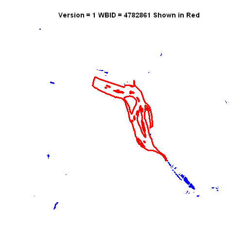 


```
## Map from URL : http://maps.googleapis.com/maps/api/staticmap?center=40.155236,-76.750285&zoom=12&size=%20640x640&scale=%202&maptype=satellite&sensor=false
## Google Maps API Terms of Service : http://developers.google.com/maps/terms
```

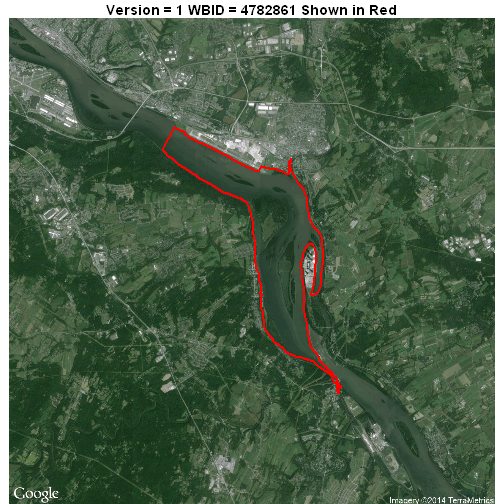 


```r
Row <- nrow(joinMRB1_V1V2) + 1  #row to add
joinMRB1_V1V2[Row, "WBID_V1"] <- 4782861
joinMRB1_V1V2[Row, "flag"] <- 4
joinMRB1_V1V2[Row, "comment"] <- "In V1 but not V2."
```


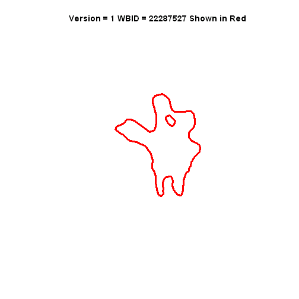 


```
## Map from URL : http://maps.googleapis.com/maps/api/staticmap?center=43.118195,-72.28975&zoom=14&size=%20640x640&scale=%202&maptype=satellite&sensor=false
## Google Maps API Terms of Service : http://developers.google.com/maps/terms
```

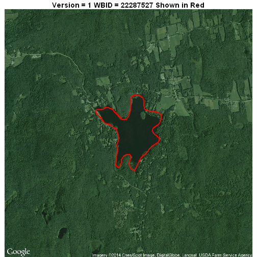 


```r
Row <- nrow(joinMRB1_V1V2) + 1  #row to add
joinMRB1_V1V2[Row, "WBID_V1"] <- 22287527
joinMRB1_V1V2[Row, "flag"] <- 4
joinMRB1_V1V2[Row, "comment"] <- "In V1 but not V2."
```


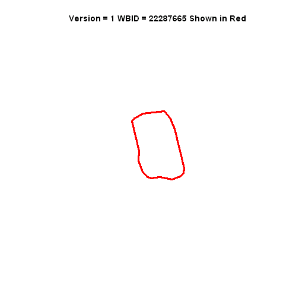 


```
## Map from URL : http://maps.googleapis.com/maps/api/staticmap?center=43.304796,-73.681789&zoom=16&size=%20640x640&scale=%202&maptype=satellite&sensor=false
## Google Maps API Terms of Service : http://developers.google.com/maps/terms
```

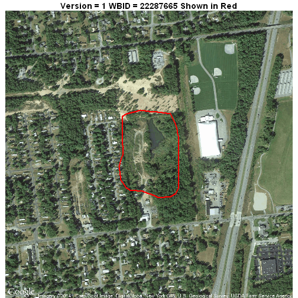 


```r
Row <- nrow(joinMRB1_V1V2) + 1  #row to add
joinMRB1_V1V2[Row, "WBID_V1"] <- 22287665
joinMRB1_V1V2[Row, "flag"] <- 4
joinMRB1_V1V2[Row, "comment"] <- "In V1 but not V2."
```


```
## Error: missing value where TRUE/FALSE needed
```


```
## Error: missing value where TRUE/FALSE needed
```


```r
Row <- nrow(joinMRB1_V1V2) + 1  #row to add  
joinMRB1_V1V2[Row, "WBID_V2"] <- 15516920
joinMRB1_V1V2[Row, "flag"] <- 5
joinMRB1_V1V2[Row, "comment"] <- "In V2 but not V1."
```


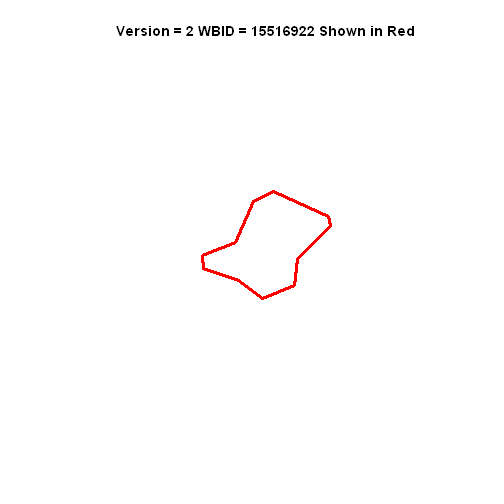 


```
## Map from URL : http://maps.googleapis.com/maps/api/staticmap?center=43.457838,-75.345451&zoom=16&size=%20640x640&scale=%202&maptype=satellite&sensor=false
## Google Maps API Terms of Service : http://developers.google.com/maps/terms
```

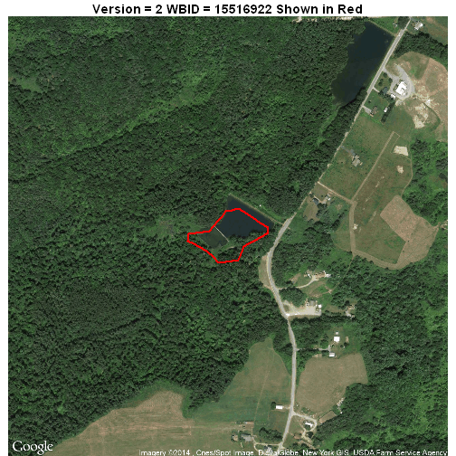 


```r
Row <- nrow(joinMRB1_V1V2) + 1  #row to add  
joinMRB1_V1V2[Row, "WBID_V2"] <- 15516922
joinMRB1_V1V2[Row, "flag"] <- 5
joinMRB1_V1V2[Row, "comment"] <- "In V2 but not V1."
```


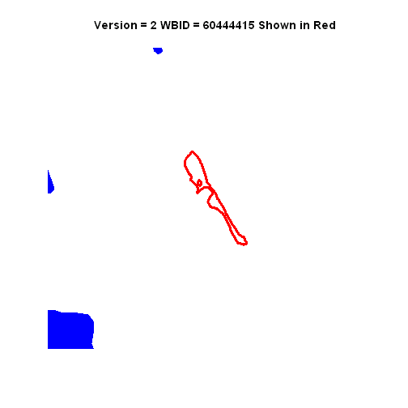 


```
## Map from URL : http://maps.googleapis.com/maps/api/staticmap?center=41.327801,-74.189293&zoom=15&size=%20640x640&scale=%202&maptype=satellite&sensor=false
## Google Maps API Terms of Service : http://developers.google.com/maps/terms
```

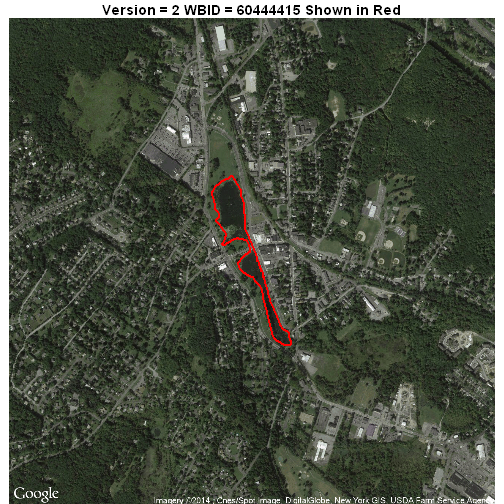 


```r
Row <- nrow(joinMRB1_V1V2) + 1  #row to add  
joinMRB1_V1V2[Row, "WBID_V2"] <- 60444415
joinMRB1_V1V2[Row, "flag"] <- 5
joinMRB1_V1V2[Row, "comment"] <- "In V2 but not V1."
```


The missing lakes-the penultimate
-------------------------
* V1_WBID=10312598 is the southern edge of Lake Champlain (V1 and V2 WBID=22302965)
* In the Waterbody database V1_WBID=10312598 is separate from V1_WBID=22302965 
* When the overlay was done above V1_WBID=22302965 was matched to V2_WBID=22302965
* The match between V1 and V2 WBID=22302965 joinMRB1_V1V2 was flagged and commented
* A new entry in joinMRB1_V1V2 showing the link between V1_WBID=10312598 and V2_WBID=22302965 was added.
* Here are the graphics for V1_WBID=10312598:

  
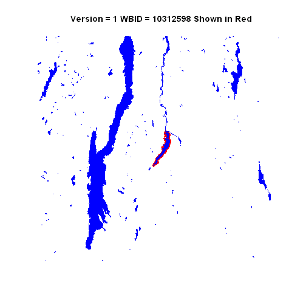 


```
## Map from URL : http://maps.googleapis.com/maps/api/staticmap?center=43.558438,-73.455178&zoom=10&size=%20640x640&scale=%202&maptype=satellite&sensor=false
## Google Maps API Terms of Service : http://developers.google.com/maps/terms
```

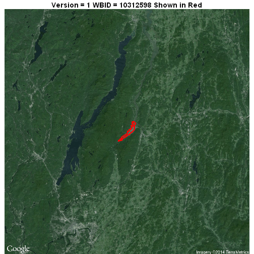 

```
## Error: missing values are not allowed in subscripted assignments of data
## frames
```

```
## Error: missing values are not allowed in subscripted assignments of data
## frames
```


The missing lakes-the ultimate
-------------------------
* The overlay did not find a match for V2_WBID=166421080 in V1
* When V2_WBID=166421080 and  V1 lakes are plotted V2_WBID=166421080 is seen to be colocated with a V1 lakes
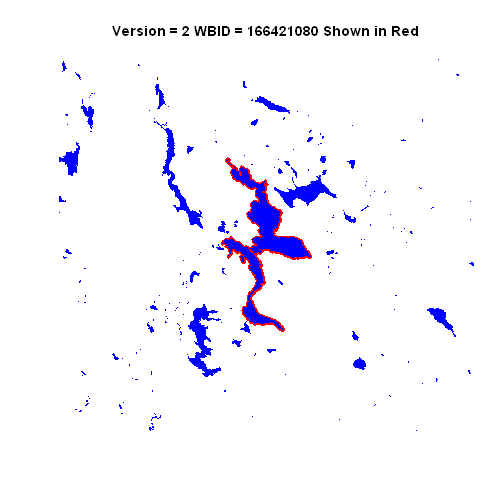 

* When he HUC01 shapefile is opened in ArcMap there is no lake corresponding to  V2_WBID=166421080 in the attribute table.
* V2_WBID=19333669,however, is in the same location.
* Returning to R V2_WBID=19333669 and V2_WBID=166421080 are plotted and are clearly the same lake; in the same location and the areas match.
* So this is what is happening.  Lake V2_WBID=166421080 and V2_WBID=19333669 are the same lake and one should be deleted.
* V2_WBID=19333669 is also the same as V1_WBID=19333669
* Need to update joinMRB1_V1V2 to reflect this adding a new flag code #5 to explain what happened.


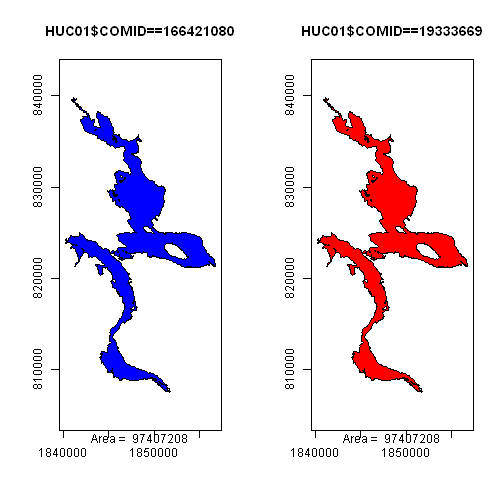 


```
##        WBID_V1  WBID_V2 flag
## 26380 19333669 19333669    0
##                                                comment
## 26380 Same Lake; WBID_V1==WBID_V2 and lake areas match
```


QAQC-Check to make sure all V1 and V2 WBIDs are included in joinMRB1_V1V2
-------------------------
* All V1 and V2 WBIDs are in joinMRB1_V1V2


```r
table(V1$WB_ID %in% joinMRB1_V1V2$WBID_V1)
```

```
## 
##  TRUE 
## 28122
```

```r
table(V2$COMID %in% joinMRB1_V1V2$WBID_V2)
```

```
## 
##  TRUE 
## 28130
```


* Checking if all joinMRB1_V1V2 WBIDs are in V1 and V2 shows that for each Version 3 are missing
* For each version 3 lakes are found in one version and not the next so the mis-matches are NAs.


```r
table(joinMRB1_V1V2$WBID_V1 %in% V1$WB_ID)
```

```
## 
## FALSE  TRUE 
##     3 28133
```

```r
joinMRB1_V1V2[which(joinMRB1_V1V2$WBID_V1 %in% V1$WB_ID == FALSE), ]
```

```
##       WBID_V1  WBID_V2 flag           comment
## 28132      NA 15516920    5 In V2 but not V1.
## 28133      NA 15516922    5 In V2 but not V1.
## 28134      NA 60444415    5 In V2 but not V1.
```

```r
table(joinMRB1_V1V2$WBID_V2 %in% V2$COMID)
```

```
## 
## FALSE  TRUE 
##     3 28133
```

```r
joinMRB1_V1V2[which(joinMRB1_V1V2$WBID_V2 %in% V2$COMID == FALSE), ]
```

```
##        WBID_V1 WBID_V2 flag           comment
## 28129  4782861      NA    4 In V1 but not V2.
## 28130 22287527      NA    4 In V1 but not V2.
## 28131 22287665      NA    4 In V1 but not V2.
```


Save the data
-------------------------
* joinMRB1_V1V2 save to './tables/joinMRB1_V1V2.rda'


